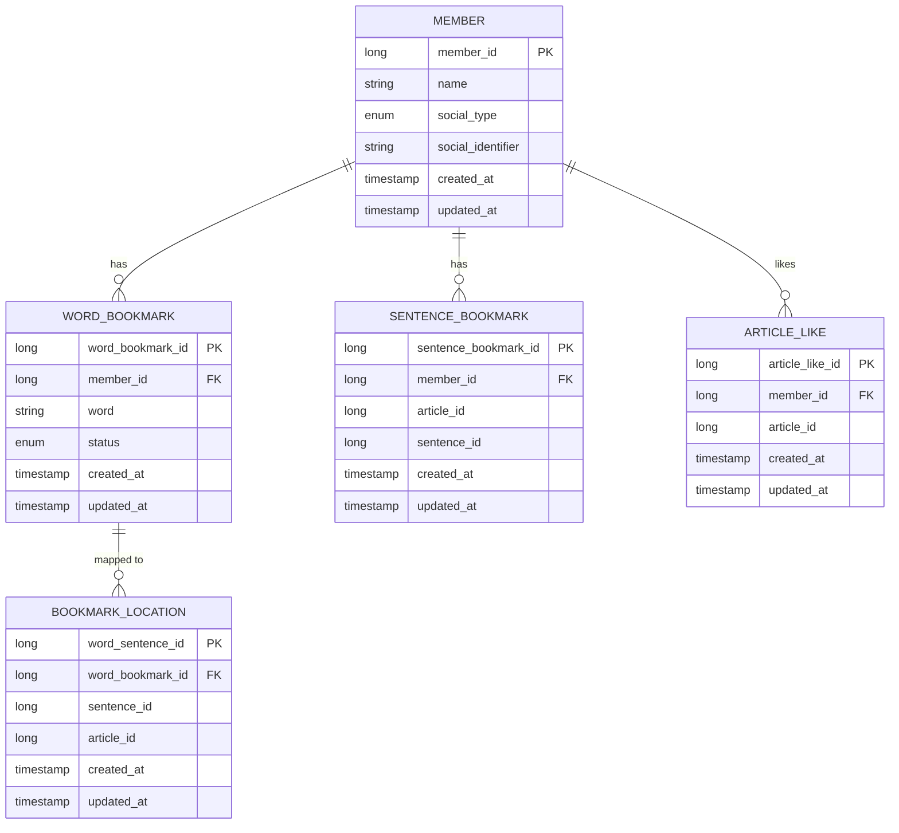

MySQL



MongoDB

article

```json
{
  "_id": ObjectId("임의의 아이디 값"),
  "news_id": "world/2025/jul/31/hot-weather-japan-south-korea-record-breaking-heat",
  "title": "MoD staff were warned not to share hidden data before Afghan leak",
  "url": "https://www.bbc.co.uk/news/articles/cwy5e911j37o",
  "published_at": "2025-08-28T04:52:16.474Z",
  "category": "News & Politics",
  "status": "raw",
  "raw_content": "Authorities in Japan and South Korea have urged people to take precautions to prevent heatstroke, as the region reels from record-breaking temperatures and pressure on hospitals.\n\nOn Thursday, Sou..." //전체 내용 有
  "embedding_vector": [0.123, -0.456, 0.789, ...], 
  "thumbnail": "https://media.guim.co.uk/bc0ea8d2306558733eec7935792d367e4cf31d5a/0_0_305,1_2440/500.jpg",
  "sentences": [
    {
      "text": "South Korea’s birthrate surged at its fastest pace in more than three decades in April, offering tentative signs of recovery in a country grappling with the world’s lowest fertility rate, official data showed.",
      "tokens": [
	      {
	        "text": "South",
          "lemma": "South",
          "ner_tag": "GPE",
          "dep_tag": "compound",
          "head_token_text": "Korea"
        },
        ...
        {
          "text": ".",
          "lemma": ".",
          "ner_tag": "0",
          "dep_tag": "punct",
          "head_token_text": "showed"
        }
      ],
      "translation": "공식 데이터에 따르면 4월 한국의 출산율은 30년 만에 가장 빠른 속도로 급증하여 세계 최저 출산율과 씨름하는 국가에서 잠정적인 회복 조짐을 보이고 있습니다.",
      "sentence_id": 1,
      "is_paragraph_end": true // 문단의 끝인 문장이면 true, 아니면 false
    },
    ...  
  ],
  "difficulty": 69.3,                 // 내부 난이도 점수
  "view_7d": 132, // 7일간 조회수(인기순 계산용)
  "like_7d": 57, // 7일간 좋아요수(인기순 계산용)
  "grade_7d": 21, // 7일간 채점수(인기순 계산용)
  "popularity_score": 0.742, // 인기 점수(인기순 계산용)
  "popularity_updated_at": "2025-09-08T15:33:00Z", // 인기 관련 데이트 업데이트 timestamp 
  "processed_at": null, // 전처리 완료 시간
  "created_at": "2025-08-28T04:52:16.474Z", // API에서 가져와서 데이터베이스에 넣은 시간
  "updated_at": "2025-09-15T08:00:00Z"
}
```

evaluate

```json
{
  "_id": ObjectId("67c5e911j37o1234abcd5678"),
  "member_id": 1, // MySQL member 테이블의 member_id
  "article_id": "bbc-news-cwy5e911j37o", // MongoDB articles 컬렉션의 _id
  "score": 85,
  "analysis": [
		{
	    "sentence_id": 0,
	    "user_translation": "ICO 메모에 의하면, 유출 당시 가이드는 국방부가 데이터 공유 위험을 안다는 것을 보여줬다.",
	    "is_correct": true,
	    "feedback" : ""
	  },
	  {
	    "sentence_id": 1,
	    "user_translation": "이 가이드는 데이터에서 숨겨진 데이터를 지울 필요를 참조했다.",
	    "is_correct": false,
	    "feedback" : "'unexpectedly'는 '예상치 못하게', '뜻밖에'와 같은 자연스러운 부사로 번역하는 것이 적절합니다. 또한 'slip into'는 단순히 '들어가다'는 의미를 넘어 '슬그머니', '어느새 조용히'와 같은 뉘앙스를 포함하므로, '경기 침체에 빠졌다'와 같이 부드러운 표현이 더 자연스럽습니다."
	  }
  ],
  "created_at": "2025-08-28T04:52:16.474Z",
  "updated_at": "2025-09-15T08:00:00Z"
}
```

event

```json
{
  "_id": 1024391,
  "member_id": 832,                            // 사용자 ID (MySQL과 연동됨)
  "article_id": "bbc-news-cwy5e911j37o",       // MongoDB에서의 기사 ID (ObjectId 또는 String 가능)
  "event_type": "READ_COMPLETE",              // 행동 유형: ENUM
  "timestamp": "2025-09-08T15:39:00Z",
  "created_at": "2025-08-28T04:52:16.474Z",
  "updated_at": "2025-09-15T08:00:00Z"
}
```

member_profile

```json
{
  "_id": 832,                               // 사용자 ID (MySQL members 테이블과 FK 연동)
  "user_vec": [0.12, 0.18, -0.27, ...],            // 사용자 취향 벡터 (float[], 길이 384 또는 768)
  "read_count": 13,                                // 벡터 평균 계산용 카운터
  "categories": ["science", "tech"],               // 관심 카테고리 배열
  "level_cefr": "B1",                              // CEFR 레벨 (A1~C2)
  "level_score": 69.3,                             // 내부 실력 점수
  "level_count": 17,                               // 채점 반영 횟수
  "created_at": "2025-09-08T15:39:00Z",            // 생성 시각
  "updated_at": "2025-09-15T08:00:00Z"             // 최근 갱신 시각
}
```

v4 - 다 같이

v3 - 조예림

v2 - 조예림

v1 - 다 같이